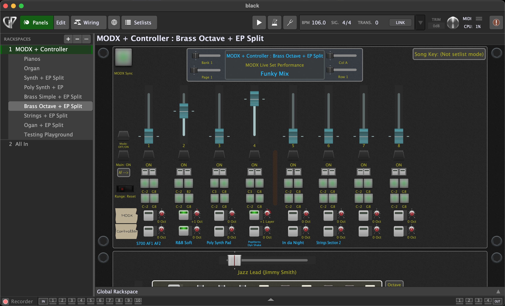
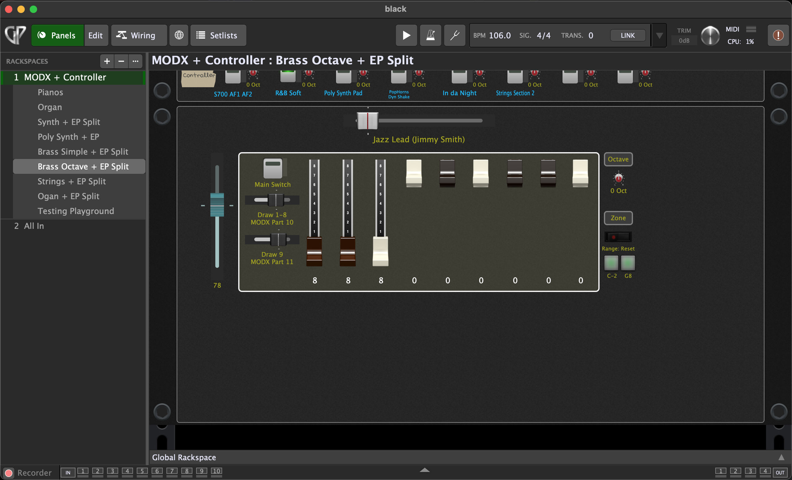
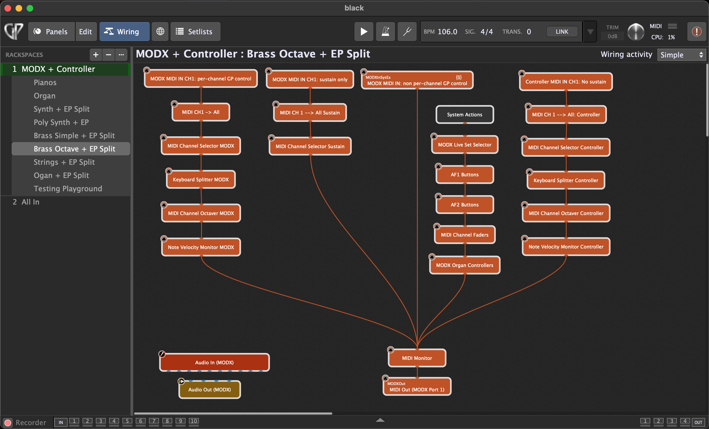

# Paulo Medeiros' Gig Performer Toolkit for Yamaha MODX

[](LICENSE)

[](https://gigperformer.com)
[](https://usa.yamaha.com/products/music_production/synthesizers/modx/index.html)

This is a collection of reusable GPScript utilities and MODX helpers developed for my own Gig Performer/MODX live rig. The focus is MIDI routing and control, with the MODX as the sound engine and Gig Performer as its control layer.

The project reflects my own gigging needs and preferences, but I try to keep the scripts as reusable and general as my free time allows. I hope they are also useful to other GP/MODX users.

## Example Setup

Here is how I use the toolkit in my own Gig Performer setup. The main panel brings
together MODX Performance selection, per-channel controls, keyboard splits, and octave
settings:



The organ panel exposes the drawbar controls for the MODX "All 9 Bars!" Performance:



Behind the panels, the scriptlets are connected in the wiring view:



## Status

Early development. Public API changes and repo structure are still likely to occur.

## System Requirements

Tested primarily with:

- Yamaha MODX7 (original MODX generation, not the MODX+)
  - Firmware v2.52.0
- Gig Performer Pro 5.2.2

It may work for other Gig Performer and MODX versions, as well as for the MODX+ or MONTAGE
after targeted adaptations, but I have not tested them (wish I had them to test).

## Repository Contents

### Scriptlets

The following files under `gpscript/scriptlets/` are standalone GP scriptlets:

- `expression_pedal_signal_mapper.gpscript`: map one expression pedal to selectable
  combinations of Expression, Modulation, Channel Aftertouch, Cutoff, Pitch Bend, and
  Breath Controller per MIDI channel.
- `keyboard_splitter.gpscript`: create lower/upper keyboard zones per MIDI channel, with
  controls for resetting boundaries or learning them from played notes.
- `midi_channel_octaver.gpscript`: transpose notes or add octave layers per MIDI channel.
- `midi_channel_selector.gpscript`: allow MIDI from enabled channels while always passing
  release-type messages to help prevent stuck notes and controllers.
- `midi_channel_volume_faders.gpscript`: send MIDI CC7 volume values per channel, show the
  current numeric values in the parameter text, and provide fader locking and manual resend.
- `modwheel_broadcaster.gpscript`: broadcast Mod Wheel messages from MIDI channel 1 to
  enabled channels.
- `modx_assignable_function_buttons.gpscript`: send MODX AF1 or AF2 state per MIDI channel.
  Each instance controls one of the two buttons; use two instances to control both.
- `modx_live_set_selector.gpscript`: select MODX Live Set performances and request
  Performance and Part names. To display synced names in widgets, use it together with
  the MODX rackspace SysEx receiver/template.
- `modx_organ_controllers.gpscript`: control drawbars and presets for the MODX
  "All 9 Bars!" organ Performance.
- `note_event_broadcaster.gpscript`: broadcast notes from MIDI channel 1 to enabled
  channels while allowing note releases through to all channels.
- `note_velocity_monitor.gpscript`: display the latest note velocity per MIDI channel.
- `pitchbend_broadcaster.gpscript`: broadcast Pitch Bend messages from MIDI channel 1
  to enabled channels.
- `sustain_broadcaster.gpscript`: broadcast Sustain messages from MIDI channel 1 to
  enabled channels while allowing fully-off messages through to all channels.

`cc_event_broadcaster.gpscript` is a shared scriptlet include used by the Mod Wheel and
Sustain broadcasters. It expects the including scriptlet to define `TargetCCNumber` and
is not intended to be loaded directly.

### Gig and Rackspace Scripts

- `gig_scripts/song_change_toggle_osc_trigger.gpscript`: toggle an OSC value whenever the
  current song changes. It sends to the local `/SongChangeTrigger/SetValue` OSC address,
  which requires a corresponding OSC-addressable target.
- `rackspace_scripts/MODX_Toolkit_RackspaceScriptTemplate.gpscript`: minimal rackspace
  template that receives MODX SysEx and updates Performance and Part labels. Read its
  comments for the widget and MIDI block names you may need to adapt.
- `rackspace_scripts/MODX_DualKeyboardRackspaceScriptExample.gpscript`: expanded
  rackspace example for two keyboards and eight MODX Parts. It combines both keyboards'
  Part-selection state and uses it to highlight active Part labels.

### Include Files

The `gpscript/GeneralUtils/` folder contains reusable building blocks:

- `StringUtils.gpscript`: validate and convert printable ASCII bytes, and format integers
  as right-aligned text.
- `ChannelAwareMidiCCFilter.gpscript`: reusable per-channel CC filter that expects the
  including scriptlet to define `CCNumber`.
- `MainAndChannelOnOffSwitches.gpscript`: shared main/channel parameters and channel
  permission helpers.
- `Midi.gpscript`: general MIDI helpers, including release-message detection.
- `SysEx.gpscript`: general Yamaha SysEx validation.

The `gpscript/MODX/` folder contains MODX-specific includes:

- `PerformanceNameSysexReceiver.gpscript`: receive and display the current Performance name.
- `PerformancePartNameSysexReceiver.gpscript`: receive and display Performance Part names.
- `SysEx.gpscript`: validate and classify MODX SysEx messages.

## Using The Files

At this stage, installation is manual:

1. Clone or copy this repository directory under the folder Gig Performer uses as the root
   for GPScript `Include` paths. If you keep your working clone elsewhere, you can instead
   create a symbolic link to it under that folder.

   - On Windows, it's usually `C:\Users\<your user name>\Documents\Gig Performer\Scripts`
   - On Mac, it's usually `/Users/<your user name>/Documents/Gig Performer/Scripts`

2. Keep the directory name as `gigperformer-modx-toolkit`
3. For a standalone scriptlet, create a Scriptlet plugin and add an `Include` line in its
   editor for the file you want to use. For example:

   ```gpscript
   Include "gigperformer-modx-toolkit/gpscript/scriptlets/keyboard_splitter"
   ```
4. Gig and rackspace scripts can be included directly when they are the complete script for
   that scope. If you already have script code, copy the relevant template into a user-owned
   `.gpscript` file, customize it, merge your other callbacks into that file, and include the
   resulting complete script from the corresponding Gig Performer script editor. Keep the
   customized file under the GPScript `Include` root, and outside this toolkit repository, so
   toolkit updates do not overwrite it.
   Some files also assume specific widget handles, MIDI block names, or MODX settings. Those
   assumptions are documented mostly in the scripts.

   - If applicable, create any required widgets and MIDI blocks with the expected names
   - This is usually not required for scriptlets

5. Compile the scripts or scriptlets you use in Gig Performer.

## Safety

These scripts can send MIDI CC, Program Change, OSC, and SysEx messages. Test in
a duplicate gig file and use a backup MODX Performance or Live Set while trying
things out.

## Getting in Touch

Feel free to get in touch here on GitHub should you need help or wish to contribute.

## Disclaimers

This project is personal and is not affiliated with, endorsed by, or sponsored
by Yamaha, Deskew Technologies, or Gig Performer.

Yamaha, MODX, MONTAGE, Gig Performer, and related names belong to their
respective owners.
